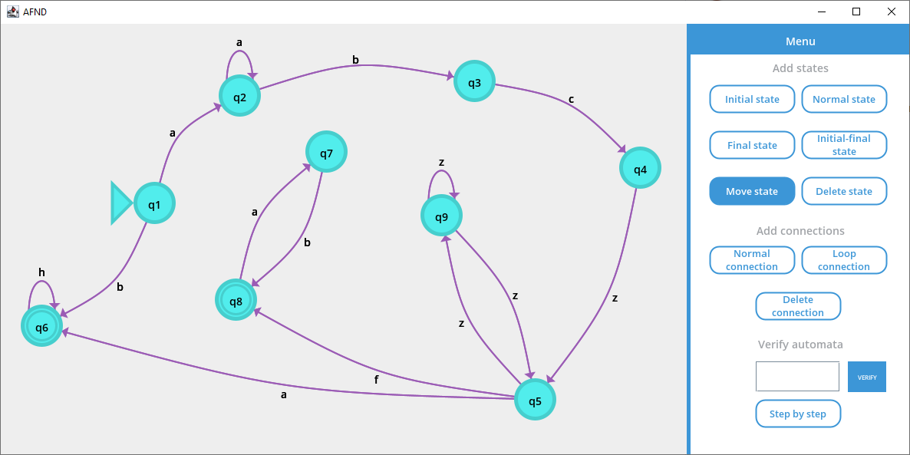
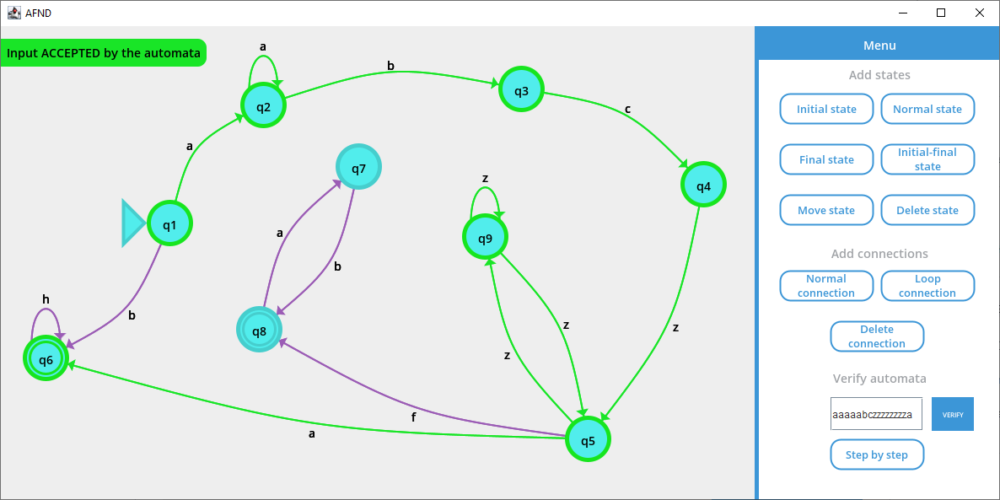
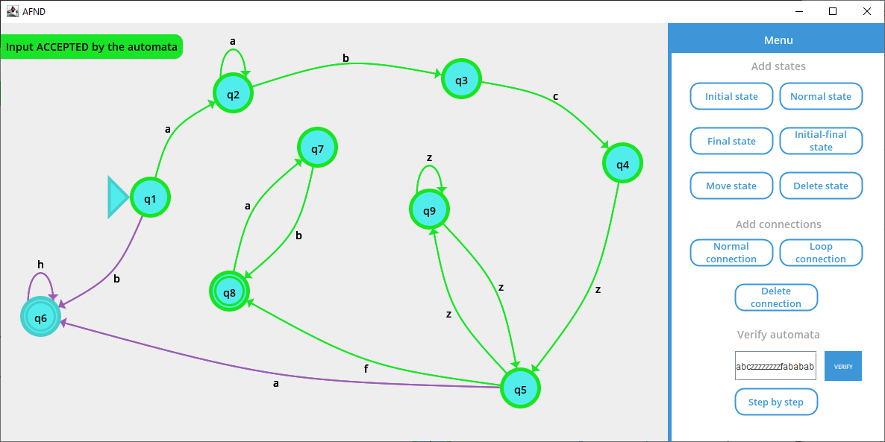
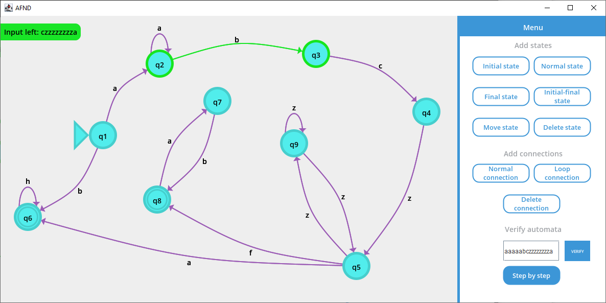
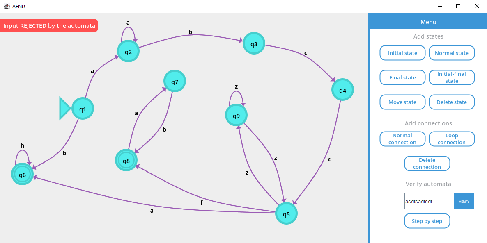

# Autómata finito no determinista

El programa le permite al usuario crear un autómata finito de manera gráfica;
además, permite ejecutar el autómata paso a paso para verificar si una cadena de
texto es aceptada o rechazada por el autómata.

> Este proyecto está fuertemente inspirado de
> esta [idea](https://github.com/Shadic78/ProyectoAutomatasFinitos), con la
> única diferencia de que está escrito completamente
> en [Swing](https://en.wikipedia.org/wiki/Swing_(Java)) y con mejoras en la
> inteligencia del autómata.

## Ejecutar el proyecto

Se require tener instalado:

- Maven 3
- Java 11

Y ejecutamos:

```
mvn clean package
java -jar target/AFND-1.0-SNAPSHOT.jar
```

## Capturas de pantalla

### Creación del autómata



### Validación de una cadena dado como entrada





### Verificación paso a paso de una cadena



### Rechazo de una cadena inválida


